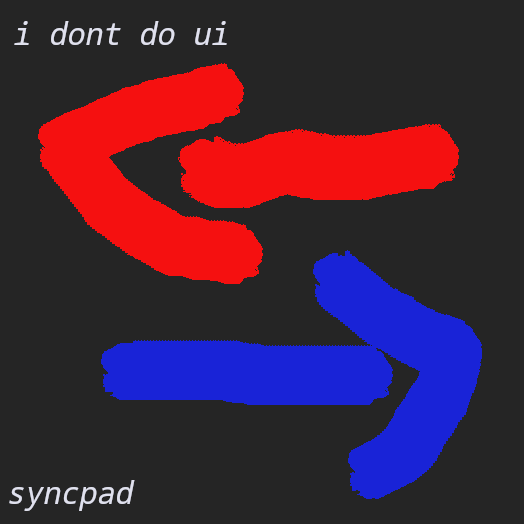

<div align="center">
  

  # SyncPad

  Local-to-SFTP sync tool for Garry's Mod servers (and others).  
  Watch a local folder and automatically push changes to your host via SFTP.

  
  
  
  

</div>

---

This is a personal project I am building to learn Go and explore GitHub workflows in practice. The goal is to simplify my GMod server development workflow, and the project should grow a lot over time.

## Features

- Containers mapping a local folder to a remote SFTP destination
- File watcher with debounce, accumulates changes until you decide to push
- Manual or automatic sync mode per container
- SFTP authentication via password or private key
- Connection test before saving
- Splash screen and clean Fyne-based UI

## Build

```bash
go mod tidy
go build ./cmd/syncpad
./syncpad
```
